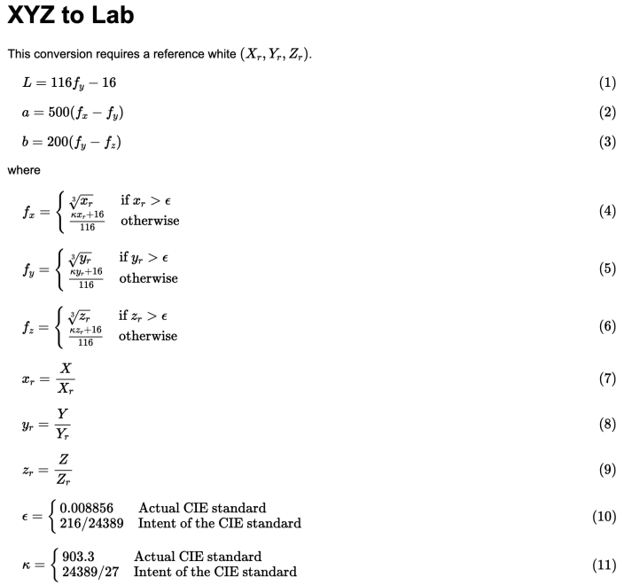

## Video

 <iframe width="560" height="315" src="https://www.youtube.com/embed/_vTTZ5to-hQ" frameborder="0" allow="accelerometer; autoplay; clipboard-write; encrypted-media; gyroscope; picture-in-picture" allowfullscreen></iframe> 

Link (incase above does not work): https://www.youtube.com/embed/_vTTZ5to-hQ

## Project Summary

  My goal for this project went through many iterations, we began by trying to figure out a project that was feasible while also piquing my interests. I had some project ideas before such as agent battle royale but ultimately settled on an image classification problem known as semantic segmentation. Semantic segmentation involves classifying each pixel of an image to some class e.g. water, sky, dirt.

#### Example of Segmented Image

 

  A combination of Malmo functions made it possible for us to determine what block/entities were on the player's screen, however, this does not apply to normal Minecraft. In normal Minecraft, the only way to determine the location and type of blocks/entities that are contained within the player's perspective is by having someone who is qualified manually look and decide. In Malmo we can generate color maps that have corresponding colors for each block/entity. To semantically segment normal Minecraft without someone manually annotating images it is necessary to apply machine learning algorithms.

#### Original Minecraft Player View

 

#### Color Map

 

## Approaches

### Data Gathering

  Before I could apply any machine learning algorithms to aid me in my semantic segmentation task I needed to create the ground truth images for my training and test set. This introduced one of the obstacles of the project, Malmos color map producer. The color maps that Malmo returns although visually identify each entity/block with a unique color in practice this is not the case, for each block/entity there were tens of thousands of very similar-looking although unique colors that identified each block/entity.

#### Initial Attempt at One-to-One Mapping

 

#### Ground Truth Color Map

 

  I had to find a way to compare all these similar colors and group them to create the ground truth images for my semantic segmentation algorithms. To solve this I found the most dominant color for each class, then converted every RGB image to a CIELAB color space, and then compared each color to one another using the CIE94 formula to find which were the most similar to their respective dominant colors. In doing so I had 162 different classes each with their unique color, this let me convert every RGB image into a greyscale image containing numbers from 0-162.
 

  I then created a algorithm to automate the label making processes by teleport the agent randomly around the surface of the minecraft world while recording both, color map and normal video which resulted in a dataset of 13000 images with a resolution of 480x720. Part of my utilisation of the RGB images and manipulation with it involved conversion to CIELAB color space. This color space is designed for detecting small differences in the color. To convert from RGB to to LAB, there were two steps: conversion from RGB to an XYZ vector and then conversion of the vector to LAB.

Conversion of RGB to XYZ was multiplying the vector by a transformation matrix. 

 
  

Conversion of XYZ to LAB used a piecewise function that applied an equation that depended on whether the components of XYZ were greater than an epsilon value.\

 
  

I then compare the LAB colors using CIE94 formula which aims to compare colors in a way such that the difference is relatable to how humans would discern the diference in colors.

 
  

### Baseline Model: K-Means

A k-means algorithm involves creating k clusters by partitioning the data depending on its distance to the nearest cluster

For segmentation, a k-means algorithm involves clustering based on the representation of a color in an RGB image. The number of clusters can be adjusted, however the optimal k value was determined by the Elbow method. The Elbow method uses the clusters centroids and the sum of its squared differences and its distance to the data point to determine the optimal amount of clusters. More about this procedure and its details are in the evaluation section.

 

#### Advantages

* Scales easily to larger data sets such as the one that was worked with

* Guarantees convergence of data to some cluster

#### Disadvantages

* Choosing the correct and optimal k value is important for the model's success and may change per image.

* Variable amount of cluster densities such as more of one color than another would skew the clusters.

#### Example of Result Image with k=8

 

### My Best Model: DeepLabV3

For semantic segmentation, I used a neural network following the DeepLabv3 architecture pre trained on resnet 101 as the model of choice with a focal loss function.
Focal loss is defined as.

 

#### Advantages

* This approach is very accurate in its predictions as seen in the evaluation section.
* Given a dataset where with labels that correspond to each class I am able to determine what blocks/entities are contained in a single image and what their location is within the image.
* The model is also able to generalize very well to the large amount of classes.

#### Disadvantages

* The model took a large amount of space in memory, the model itself was around 14 Gigs in size which left little remaining memeory on the gpu. 
* I had to then determine wether I would rather have a larger image or a larger batch size where I ultimately chose a larger image size. 
* The long train time, each batch took around 13 seconds on average to complete which led to one epoch taking around 12 hours to complete.

#### Original Image Example #1

 

#### Predicted Image #1

 

#### Original Image Example #2

 

#### Predicted Image #2

 

## Evaluation

### Elbow Method for K-Means Evaluation

For part of the K-means evaluation, I wanted to choose the optimal value of k. There were over 100 different colors and possible clusters, so I wanted an ideal k for that represented the sum of the images. I chose the elbow method which determined the optimal value for k based on the sum of squared distances (SSE) between data points and the cluster centroids. I first evaluated using the elbow method on one image with k=40 and then proceeded to test this multiple times to a numerous sample of images:

#### Elbow Method on one image:

 

#### Elbow Method on a sample of images:

 

Looking at the example graph, it would seem k=2 would be a clear choice for optimality, however I chose not to go with k=2 because I found that the model was clustering between the sky and everything else. I chose the k value of 8 as from the sum of my tests, it seemed to be the next most optimal k value.

I applied k=2 and k=8 to images to see the difference between these values. The results are shown below:

#### Original:

 

#### k=2:

 

#### k=8:

 

### Intersection Over Union 

Intersection over Union (IoU) is a metric which is designed to quantify the percent of overlap between a target and a source image.

 

The IoU is then calculated by divding the intersection which is where the model predicted correctly by the union which is every pixel which was classified a specific class for either the ground truth or prediction. Through 51 epochs, I used this metric and to evaluate my model. the graphs show the IoU values for the training and testing over these epochs.

#### Training IoU:

 

#### Testing IoU:

 

An IoU value that is closer to 1 means it is more accurate. In the training, the IoU starts at 0 and quickly increases towards 0.9-1.0 which indicates my model is able to learn quickly and accurately. 

### Loss Function

The loss functions for the training and testing data were graphed over 51 epochs. These represent the cost of my model and a good loss should decrease over time.

#### Training Loss

 

#### Testing Loss

 

From these graphs, I can interpret that my model was able to learn at a a quick rate. Both the training and testing were "spiky" and not smooth, but there was a consistent trend downwards at a curve. The training loss is not more accurate and also does not overfit the testing data, so my model is proven to work well. 

## References

https://pytorch.org/tutorials/recipes/recipes/saving_and_loading_a_general_checkpoint.html

https://www.pyimagesearch.com/2016/11/07/intersection-over-union-iou-for-object-detection/#:~:text=What%20is%20Intersection%20over%20Union,the%20popular%20PASCAL%20VOC%20challenge.

https://scikit-learn.org/stable/auto_examples/cluster/plot_kmeans_digits.html

https://en.wikipedia.org/wiki/CIELAB_color_space

https://github.com/chenxi116/DeepLabv3.pytorch

https://arxiv.org/pdf/1606.00915.pdf

https://neptune.ai/blog/image-segmentation-in-2020

https://python-colormath.readthedocs.io/en/latest/

https://pytorch.org/tutorials/recipes/recipes/custom_dataset_transforms_loader.html

https://en.wikipedia.org/wiki/CIELAB_color_space

https://www.kdnuggets.com/2019/08/introduction-image-segmentation-k-means-clustering.html

https://en.wikipedia.org/wiki/K-means_clustering

https://arxiv.org/abs/1708.02002

https://expoundai.wordpress.com/2019/08/30/transfer-learning-for-segmentation-using-deeplabv3-in-pytorch/

http://www.brucelindbloom.com/index.html?Math.html

https://en.wikipedia.org/wiki/Jaccard_index

https://towardsdatascience.com/review-deeplabv3-atrous-convolution-semantic-segmentation-6d818bfd1d74
