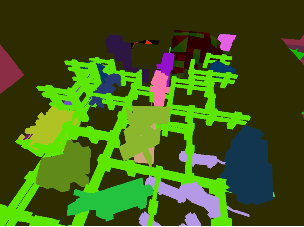

Project Description:

The project involves segmenting the first person view of an agent with respect to the block types in minecraft. Frames are captured Using a few Malmo functions to generate a video/photo of the agents first person perspective and the corresponding ground truth labels known as color maps in malmo. This is followed by a trainig a neural networks and learning to determine the various structures across this platform.

Images:

Example of generated color map

Articles that were found helpful:

https://arxiv.org/pdf/1606.00915.pdf

https://neptune.ai/blog/image-segmentation-in-2020
