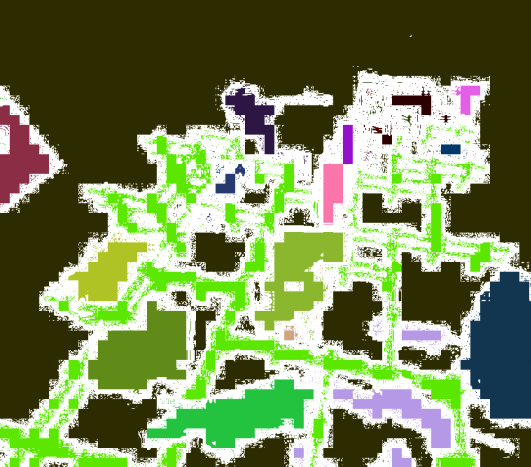
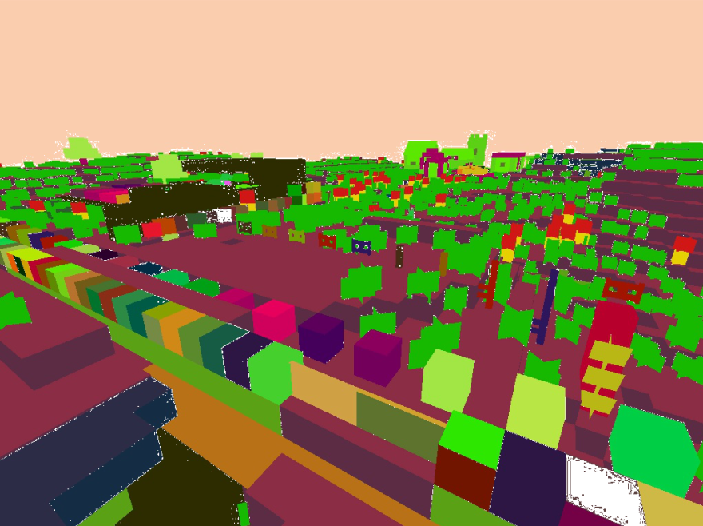

Team Members:

Kevin Chen, Alex Zuzow, Thy Ton

Project Description:

Our project involves segmenting the first person view of an agent and labeling each general structure. The program starts by scanning the nearby blocks and determining the surface block that would be in line of sight of the player. This allows us to know the location and label of any given block or entity in the player's line of sight. This is followed by segmenting the player's pov with the help of a few Malmo functions to generate a video/photo of their view. This is followed by a trainig algorithm using neural networks and learning to determine the various structures across this platform.

Images:

Examples of generated color maps

Articles that we found helpful:

https://arxiv.org/pdf/1606.00915.pdf

https://neptune.ai/blog/image-segmentation-in-2020
