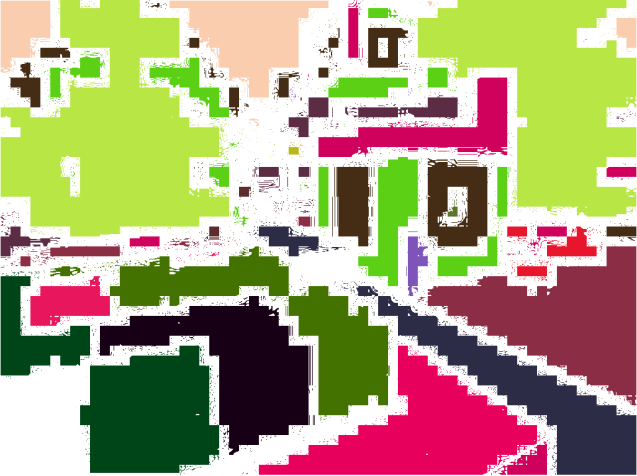

## Summary
Our Semantic Segmentation involves predicting the class of each pixel in the agent player's view. The classes are not just the individual blocks, but the general structures that may appear in Minecraft such as a tree, a building, or a pond. The goal is for both performance and time to be as optimal as possible, so that it can annotate each pixel of the view while the agent walks around in the world. Since our proposal, we've found the solution to collect images and their ground truths. These will serve as our model's training and testing dataset. We've also changed our base model from UNET to k-means. We look into how much better DeepLab model can do than the k-means model.

### Video
<iframe width="560" height="315" src="https://www.youtube.com/embed/brrMn67sN6M" frameborder="0" allow="accelerometer; autoplay; encrypted-media; gyroscope; picture-in-picture" allowfullscreen></iframe>

## Approach
Our approach can be broken into a few steps.
###  1.   Data gathering
The first step was data gathering which was a little more complicated than it
may seem. In order for us to train our semantic segmentation model, we needed images and their ground truths recordings of the Minecraft player's screen and their ground truths as the agent explores the world. Here is an illustration of image and ground truth ([Image Credit](https://arxiv.org/abs/1611.09326)).

####   Agent exploring the world
We set the agent in `Spectator` mode through XML element `<AgentSection mode="Spectator">` so the agent is able to fly and does not interact with the surronding world throughout the exploration. We randomly place the agent anywhere it can stand for a period so the recorder could capture the view. At each sampled position in the world, we scan the surround block types to determine if the agent can stand and a visible surface.

####   Generating the player screen images and ground truths
We use [MissionRecordSpec.recordMP4(TimestampedVideoFrame.FrameType, frames_per_second, bit_rate)](https://microsoft.github.io/malmo/0.30.0/Documentation/structmalmo_1_1_mission_record_spec.html#abb9a25b0709327867295d2ce21d8b086) to request that screen player video be recorded. Using the following `FrameType`'s lets us record the original version and "near" ground truth version of the videos:

***FrameType=VIDEO: Original version***
<iframe width="560" height="315" src="https://www.youtube.com/embed/hgak0LM6nwE" frameborder="0" allow="accelerometer; autoplay; encrypted-media; gyroscope; picture-in-picture" allowfullscreen></iframe>

 
***FrameType=COLOUR_MAP: Ground truth version***
<iframe width="560" height="315" src="https://www.youtube.com/embed/DWryONNKgQ0" frameborder="0" allow="accelerometer; autoplay; encrypted-media; gyroscope; picture-in-picture" allowfullscreen></iframe>

We then use package `cv2` to extract and pair up image frames from these videos. Minecraft uses many similar colors to represent the same entity class. For example, colors `#2e2b00` and `#2d2c00` are associated with class **`dirt`**. That leads to 1.32 million colors mapping 180 classes in the world. Our goal is to have a have one-to-one mapping color mask to entity class. We achieve this by using package [python-colormath](https://python-colormath.readthedocs.io/en/latest/color_objects.html). 

*original frame*

*ground truth frame*

*our first attempt to generate the one-to-one mapping*

*our second attempt to generate the one-to-one mapping*

###   2.   Training
After the data is obtained, it is fed into k-means algorithm. Also, it is fed to a pretrained deeplabv3 model to transfer learning to minecraft images.

## Evaluation

The first evaluation metric that we will utilize is IOU validation (Intersect over union). This type of validation measures
exactly what we need, the accuracy of an object detector over a dataset, in this case over blocks in minecraft. The evaluation
metric creates a predicted bounding box of where the image is located on the screen where its error from the ground bounding
box can be measured. IOU can not be directly used as an algorithm, rather its sole purpose is evaluation of our model. 

A k-means algorithm will also be along the side to give us an approximate evaluation of the performance of our algorithm 
which we will use to compare the results and accuracy of the labeling. This evaluation will come first before moving onto
an evaluation of the algorithm's efficiency. Since the semantic segmentation must be running and outputting in real time,
the efficiency of the algorithm is also an important metric in insuring that it can be as accurate as possible in the least
amount of time. Some sacrifices may be made to accuracy to add to time.

## Remaining Goals and Challenges

We are attempting to train the data in the person's view to label the different structures including tree and building. This is achieved by adding a deep learning algorithm and a reinforcement learning algorithm which we are currently sifting through the details for. The algorithm ideas and implementation were the result of researching reading multiple learning algorithms that have been implemented into real life semantic segmentations. These algorithms are often much more detailed and account for a lot
more than we may need for Minecraft because ultimately, there are more details in the real world than Minecraft. We will end by the evaluation where a quick k-means algorithm will be used to evaluate the performance of the implemented learning algorithms.

## Resources Used

https://en.wikipedia.org/wiki/CIELAB_color_space

https://github.com/chenxi116/DeepLabv3.pytorch

https://arxiv.org/pdf/1606.00915.pdf

https://neptune.ai/blog/image-segmentation-in-2020

https://python-colormath.readthedocs.io/en/latest/

https://pytorch.org/tutorials/recipes/recipes/custom_dataset_transforms_loader.html

